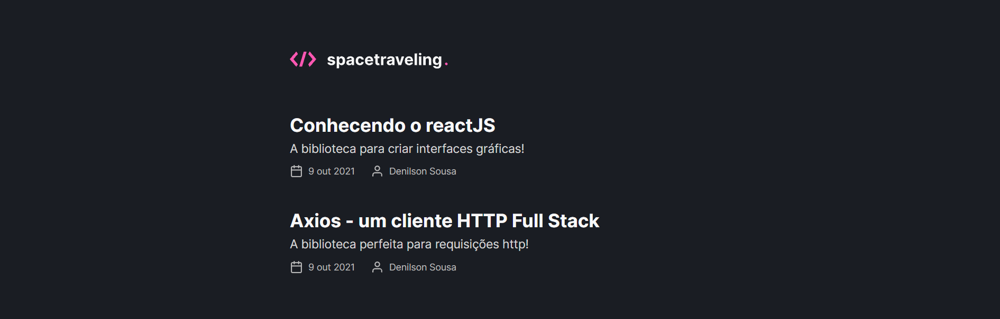

<h1 align="center">
    
    <br>Desafio 05 - Criando um projeto do Zero<br/>
</h1>

<p align="center">
  <a href="#notebook_with_decorative_cover-sobre">Sobre</a>&nbsp;&nbsp;&nbsp;|&nbsp;&nbsp;&nbsp;
  <a href="#dart-desafio">Desafio</a>&nbsp;&nbsp;&nbsp;|&nbsp;&nbsp;&nbsp;
  <a href="#computer-tecnologias">Tecnologias</a>&nbsp;&nbsp;&nbsp;|&nbsp;&nbsp;&nbsp;
  <a href="#rocket-executando">Executar</a>&nbsp;&nbsp;&nbsp;|&nbsp;&nbsp;&nbsp;
  <a href="#page_facing_up-licença">Licença</a>
</p>

## :notebook_with_decorative_cover: Sobre
O spacetraveling é um blog simples que utiliza o headless CMS Prismic.

## :dart: Desafio
Essa será uma aplicação onde o seu principal objetivo é criar um blog do zero. Você vai receber uma aplicação praticamente em branco que deve consumir os dados do Prismic e ter a interface implementada conforme o layout do Figma. Você terá acesso a diversos arquivos para implementar:

- Estilizações global, comun e individuais;
- Importação de fontes Google;
- Paginação de posts;
- Cálculo de tempo estimado de leitura do post;
- Geração de páginas estáticas com os métodos `getStaticProps` e `getStaticPaths`;
- Formatação de datas com `date-fns`;
- Uso de ícones com `react-icons`;
- Requisições HTTP com `fetch`;
- Entre outros.

## :computer: Tecnologias
- [Next.Js](https://nextjs.org/)
- [Typescript](https://www.typescriptlang.org/)
- [ReactJS](https://reactjs.org/)
- [Prismic](https://prismic.io/docs/technologies/javascript)
- [Figma](https://www.figma.com/)

## :rocket: Executando

- ### **Pré-requisitos**
  - **[Git](https://git-scm.com/)**
  - Um gerenciador de Pacotes: **[Yarn](https://yarnpkg.com/)**.
  - Uma conta no Prismic: **[Prismic](https://prismic.io/docs/technologies/javascript)**


1. Faça um clone do repositório:
```sh
  git clone https://github.com/denilsondsousa/05-criando-um-projeto-do-zero
```

3. Siga os passos:
  - Com uma conta no Prismic você deve criar um repository;
  - Em seguida crie um custom type com o nome **posts**;
  - Você pode copiar o conteúdo do arquivo **prismic-custom-type.json** aqui do projeto e colar na aba JSON Editor do seu painel de criação do custom-type para ele ficar com a mesma estrutura necessária para a implementação desse blog;
  - Lembre-se também de criar um arquivo **.env-local** e criar uma variavel ambiente com o nome **PRISMIC_API_ENDPOINT**;
  - O valor da variavel ambiente deve ser o link da API Endpoint do seu repository no Prismic;
  - Para obter o link da sua API Endpoint basta ir nas configurações >> Api & Security >> API Endpoint
  - Para criar conteúdo (Posts) para seu blog basta ir na aba de Documents e criar posts a vontade;

4. Para executar a aplicação:
```sh
  # Primeiro: instale as dependências do projeto
  $ yarn # ou npm install

  # Inicializando a aplicação:
  $ yarn dev 
```

## :page_facing_up: Licença
Esse projeto está sob a licença MIT.
